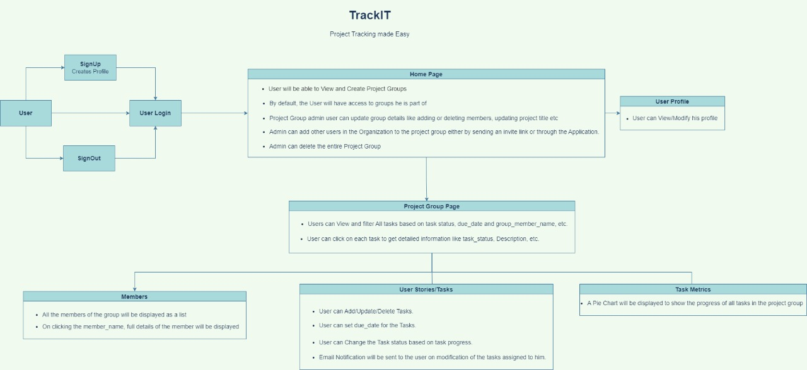

  **Academic Project as part of my Master's degree at Northeastern University**
  ***Grade: A***

# TrackIt : Project Tracking Made Easy

  

TrackIT is a Project Management Web Application used to track Team Projects, assign User Stories and provide detailed Task Analysis.

 
  

## User Requirements

  

- User Login/Register Page

- Home Page (Displays Project Groups)

- Project Group Detail Page with Project Tasks and Dashboard Metrics

  

## User Login/Register Page

  

- Register: User can create account with details username and password

- Login: Registered User can log in to their existing account

  

## Home Page

  

- User will be able to View and Create Project Groups

- User can create a new Project Group

- Project Group admin user can update group details like adding or deleting members, updating project title etc

- Admin can delete entire Project Group

- By default, User will have access to groups he is part of

- Admin can add other users in the Organization to the project group through Application.

- LoggedIn User can view or modify his profile

  

## Project Group Details page

  

- User tasks are displayed in the project details page

- User can add, update or delete tasks

- User can click on each task to get detailed information like task_status (Created, InProgress, Done), due_date, description, task_created_by, task_assigned_to, task_label (feature/bug)

- An email notification will be triggered to user on every task status change for his assigned tasks

- User can filter tasks based on task status and group_member_name, due_date

- Pie Chart will be displayed to user to show the progress of all tasks in the Project Group

- User can have detailed view (User Profile) all the existing members of the Project Group

  

## Assumptions

  

- Each User can be part of multiple Project Groups

- Each Project Group should have atleast one user

- In each Project Group, one user can be assigned multiple tasks but one task can only be assigned to one user

  

## Domain Model Diagram

  

